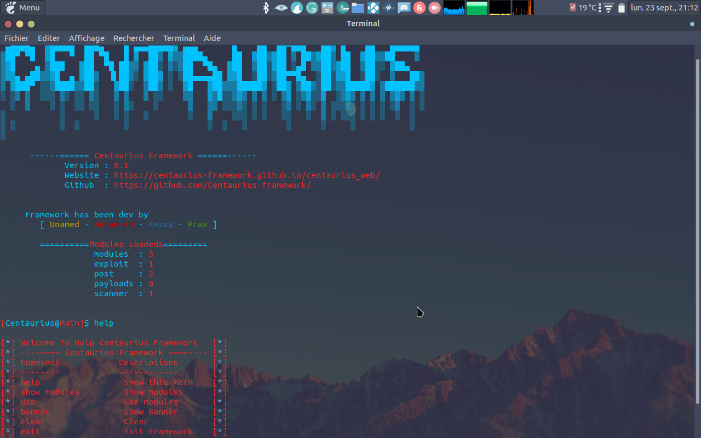

# Welcome Centaurius-Framework

## Comment Installer ? :
  apt update && apt install ruby gem ruby-colorize -y
  git clone https://github.com/Centaurius-framework/Centaurius-Framework/
  cd Centaurius-Framework
  chmod 777 *
  ruby Centaurius.rb

## Comment créer vos modules ?:
   

## Exemple de modules :
  class CentauriusModule
  #Creation d'un guetteur pour recuperer la valeur des variable lors de l'instance
    attr_accessor :infos, :param

    def initialize
    
      #setteur d'une variable infos stockant un hash avec
      #Auteur du module description du module et le titre de votre exploit

      @infos = {:Author => 'MuhamRB', :Description => 'Ceci est la description de lexploit', :Title => 'Sample print text'}

     
      #setteur d'une variable param qui va stocker tout les parametre demandé pour votre script par l'intermediaire
      #d'un Hash
      @param = {'uri' => 'www.google.fr', 'test' => nil, 'haha' => nil}
    end

    #Definition d'une function Main qui est la fonction principal
    #c'est elle qui va stocker tout le code principal pour votre module
    #notre framework fera seulement appelle à cette fonction pour executer le code
    #de votre module

    def Main()
      #code principal
      puts @param["uri"]
    end

  end

## Comment Upload vos modules dans le framework :
  pour cela faite un pull requests naviguer dans le repertoire du repos
  selectionner votre fichier ou sera votre modules par exemple post
  faite "create file" pusi copier votre modules par la suite sauvegarder ceci avec save
  retourner sur le menu du repos et faire un "merge & pull requests"

### Toute l'equipe de Centaurius Framework vous remercie =)
